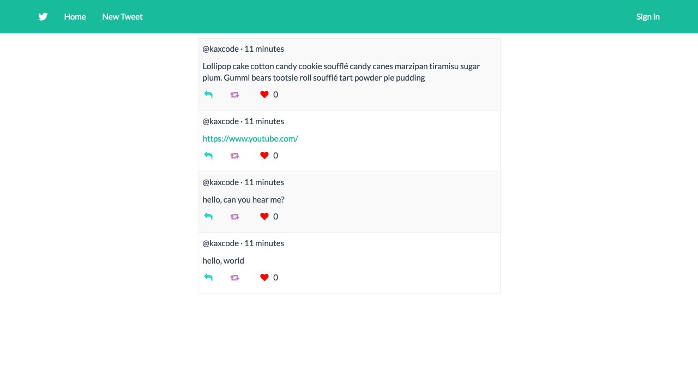

### Purpose ###
To create a basic rails app that looks like twitter.

- - - -
### How ###
1. Change the root to the index path in routes.rb
2. Create a rails scaffold called tweet that includes user_name and text. The end result is to have create_at but that's automatically made by rails.
3. Add a link in the nav bar to add a new post.
4. Change the order of the tweets to have the last post be at the top of the list.
5. Add tweets using the seeds.rb file.
6. Change the validations in tweet.rb file to require text and user_name when creating a new tweet.
7. Change the redirect URL/path for the new and update methods in tweets_controller.rb.
8. If the text includes "http://" or "https://" then use link_to to text.
9. Add the ability to like/heart a tweet.
  * Generate a model heart with user_id and tweet as references.
10. Update the routes.rb file with member do like.
11. Add the like method to the tweets_controller.
12. Add the gem 'devise' in Gemfile. Also, install and bundle 'devise'.
13. Add before_action to tweets_controller with any necessary exceptions.
14. Update the form.html.haml and tweets_controller file to ask for email instead of user_name.
15. Allow user to vote only once by going updating your method in stories_controller.rb.
16. Style bootstrap with a new theme!
17. Customize to your taste.

- - - -
### Result ###
https://shrouded-anchorage-75670.herokuapp.com/
 "End result of mini twitter"
